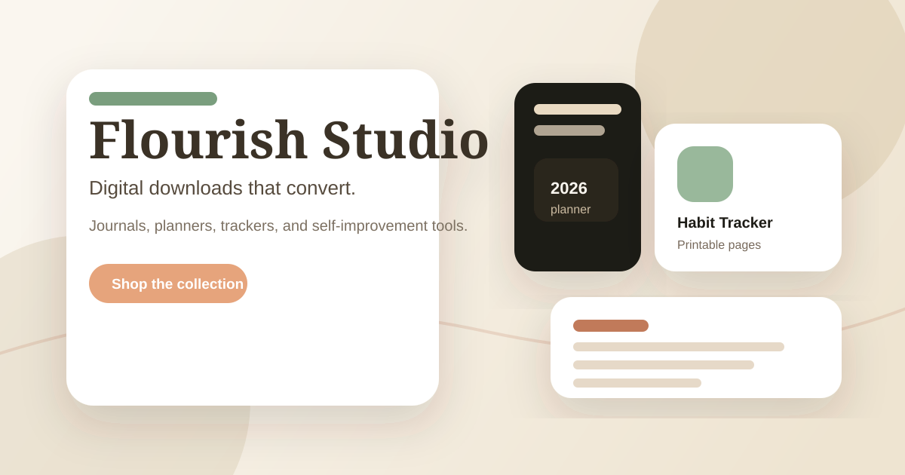

# Flourish Studio

Digital product storefront for journals, planners, and self-improvement downloads.

This repo is a clean, single-file storefront built with HTML, CSS, and vanilla JavaScript. It is designed to be easy to customize, fast to deploy, and strong enough to share as a portfolio piece, product demo, or starter template.

## Why It Stands Out

- polished editorial design instead of a generic store template
- mobile-first layout that still feels intentional on desktop
- direct checkout hooks for Selar, Gumroad, or Payhip
- strong social preview metadata for sharing
- lightweight codebase with no build step and no dependencies

## Live Demo

- [Netlify demo](https://frabjous-frangipane-42c58d.netlify.app/)

## What It Includes

- premium hero section and product grid
- mobile-first responsive layout
- checkout call-to-action hooks
- email capture section
- lightweight animations and scroll reveal
- SEO and social-share metadata in `index.html`

## Best Use Cases

- launch a digital product brand
- sell PDFs, workbooks, templates, and trackers
- test an offer before building a backend
- showcase a polished storefront in your portfolio
- ship a presentable landing page fast

## Customization

Update these areas in `index.html`:

- brand colors in the `:root` CSS variables
- product titles, prices, and checkout links
- footer contact links
- social preview metadata in the document `<head>`
- checkout URL in the `CHECKOUT_URL` constant

## Quick Start

1. Open `index.html`
2. Replace the sample product names and prices
3. Set your checkout link in `CHECKOUT_URL`
4. Deploy to Netlify or Vercel
5. Share the live URL

## Recommended Content Rules

- Keep product names specific and short
- Use real product images when available
- Replace placeholder trust cards with real testimonials
- Make the checkout path as short as possible

## Recommended Deployment

1. Deploy `index.html` to Netlify or Vercel
2. Replace the demo checkout URL with your own Selar, Gumroad, or Payhip link
3. Add a custom domain once the store is ready to share

## License

MIT
